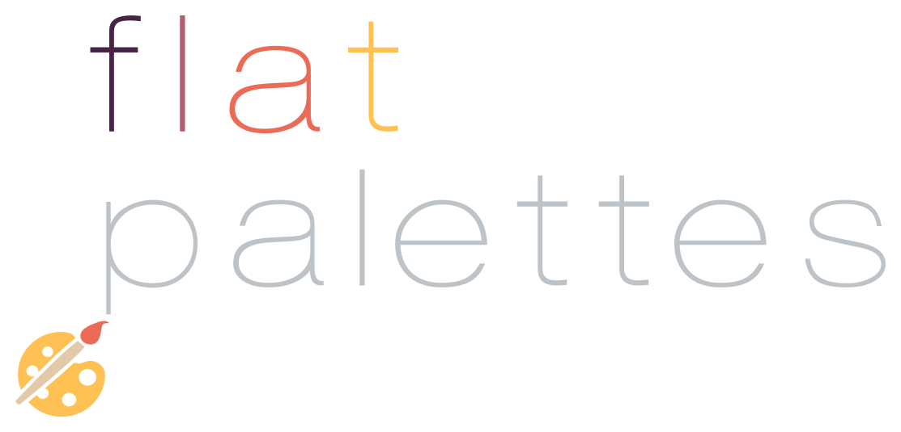

<p align="center">
  <a href="">
    
  </a>
</p>

<p align="center">
  Need color inspiration? No problem! Have some fantastic random color palettes.
</p>

<p align="center">

  <a href="https://codeship.com/projects/"></a>

  <a href="https://travis-ci.org/mabrasil/flat-palettes"></a>

  <a href="https://codeclimate.com/github/mabrasil/flat-palettes"></a>

  <a href="https://david-dm.org/mabrasil/flat-palettes" title="Dependency status"></a>

  <a href="https://david-dm.org/mabrasil/flat-palettes#info=devDependencies" title="devDependency status"></a>

</p>

## Table of Contents

- [Installation](#installation)
- [Usage](#usage)
  - [Node](#node)
  - [CLI](#cli)
- [Development](#development)
- [Contributing](#contributing)
- [Motivation](#motivation)
- [License](#license)
- [Credits](#credits)

## Installation

### Node

```sh
$ npm install --save flat-palettes
```

### CLI

```sh
$ npm install -g flat-palettes
```

## Usage

<p align="center">
  <a href="">
    
  </a>
</p>

### Node

```js
const colors = require('flat-palettes');

colors(3);
//=> ['#f7a61b', '#7cbf42', '#eb4a24']

colors(5);
//=> ['#1f518b', '#1488c8', '#f7e041', '#e2413e', '#e91222']
```

#### API

##### `colors(numberOfColors)`

###### `numberOfColors`

*Type*: `Number`

*Range*: `1` - `5`

*Description*: How many colors do you want in your flat palette?

*Example*: `3`

### CLI


All you got to do is:

```sh
$ flat-palettes <numberOfColors>
```

Where `<numberOfColors>` is the same described [here](#numberofcolors).

#### Options

| **Option**  |               **Description**                |
|-------------|----------------------------------------------|
| `--help`    | Shows project description and how to use it. |
| `--version` | Displays the current version.                |

## Development

All the tasks needed for development automation are defined in the
[`package.json`](package.json) *scripts* property and can be run via:

`npm run <command>`

Here is a summary of all the commands:

|  **Command**  |                 **Description**                 |
|---------------|-------------------------------------------------|
| `compile`     | Runs the Livescript compiler on the source.     |
| `test`        | Runs [Mocha](https://mochajs.org/) in BDD mode. |
| `build`       | Runs both `compile` and `test` commands.        |

## Contributing

Contributions are very welcome! If you'd like to contribute, these
[guidelines](CONTRIBUTING.md) may help you.

## Motivation

Finding - or thinking of - a *beautiful color palette* to use in your next
project is such a complicated - and important - task: sometimes you've just
lost all your creativity or sometimes you just can't get the right inspiration.

Then you go search through [flat](http://flatuicolors.com/)
[colors](http://www.flatuicolorpicker.com/)
[websites](http://www.flatcolorsui.com/) and get tons of those - but you still
can't combine them in a beautiful palette.

Then you find lots of those *most-wanted* inspirational palettes in
[cool](http://flatcolors.net/palettes)
[sites](http://www.dtelepathy.com/blog/inspiration/24-flat-designs-with-compelling-color-palettes).
But you still can't help yourself in choosing one amongst `2000+` options.

Then you get to my problem: choosing a random color palette which I know I'm
probably going to appreciate - and use in my project - in `5-` minutes. Luckily
you also get to the solution:
[flat-palettes](https://github.com/mabrasil/flat-palettes).

## License

[flat-palettes](https://github.com/mabrasil/flat-palettes) is distributed under
the MIT License, available in this repository. All contributions are assumed to
be also licensed under the MIT License.

## Credits

Most of the *color palettes* used in this project come from
[flatcolors.net](http://flatcolors.net/).
